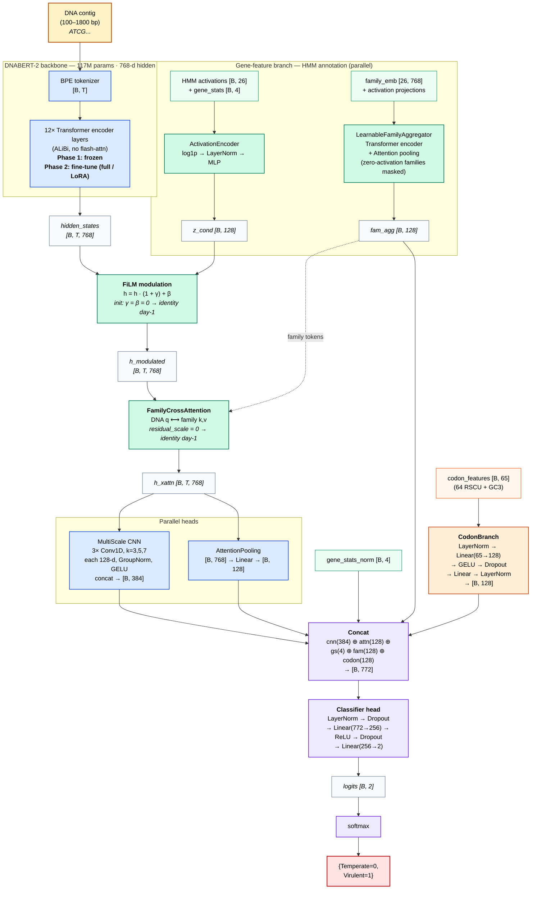

# PhaBERT-CNN_GeneGated — Architecture



## Color legend

| Color | Module type |
|-------|-------------|
| 🔵 Blue | Sequence ops (DNABERT-2, Multi-scale CNN, Attention Pooling) |
| 🟢 Green | Gene features (HMM, ActivationEncoder, FamilyAggregator, FiLM, Cross-Attention) |
| 🟠 Orange | Codon features (CodonBranch — RSCU + GC3) |
| 🟣 Purple | Fusion + Classifier head |
| 🟡 Yellow | Input |
| 🔴 Red | Output |

## Key design choices

- **Day-1 identity**: FiLM (`γ = β = 0`) and cross-attention (`residual_scale = 0`) start as identity → backbone distribution preserved on Phase 1.
- **Two-phase training**: Phase 1 frozen backbone task warmup → Phase 2 unfreeze (full or LoRA).
- **Per-contig features**: HMM activations + RSCU computed strictly within contig window — no full-genome leak.
- **Zero-activation masking**: `LearnableFamilyAggregator` masks families with zero activation → only present families contribute.
- **Multi-modal fusion**: concatenation of 5 streams (CNN, attention pool, gene stats, family aggregate, codon) → 772-d → classifier.

## Render

- **GitHub / VS Code / IDEs hỗ trợ Mermaid**: file `.md` này render trực tiếp.
- **Export PNG/SVG**: dùng [mermaid.live](https://mermaid.live) (paste code block) hoặc:
  ```bash
  npx -p @mermaid-js/mermaid-cli mmdc -i phabert_cnn_architecture.md -o phabert_cnn_architecture.svg
  ```
